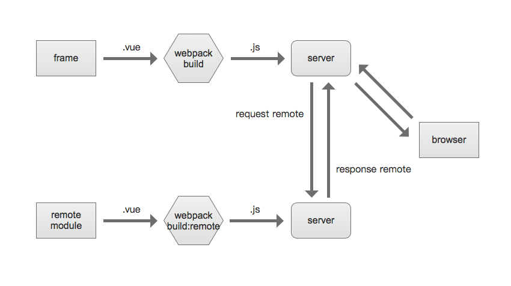

# 介绍

Vue远程模块脚手架可以把一个vue项目通过webpack打包成一个支持远程加载的js文件。我们可以在需要他的时候异步加载。执行此文件中的js代码，我们会得到一个对象，这个对象内部包含了一个业务模块所有的内容。所以本项目不是一个创新工具，它只是基于[vue-cli@3](https://cli.vuejs.org/)实现的的一种想法，一个解决方案。

## 考虑

🔗 由多个团队/组协同开发的系统，在不共同维护同一代码仓库的情况下，应该有合理的功能/业务模块划分。

📦 一个健壮的系统应当具有可扩展的能力，而不是每个模块都耦合在一起运行。任何时候开发一个符合规范（路由，状态仓库，接口，事件）的独立模块，都应该很容易热加载到现有系统。

📎 模块使用的任何资源应该是高度内聚的。模块只负责吞吐加工数据和抛出事件。模块间相互无感知，一个模块出错不应影响其他模块正常运行。

## 原理

Vue远程模块脚手架可以把我们的vue工程通过一个特殊的入口文件打包为一个完整的js文件。会返回一个包括了模块名称，api定义，状态仓库，路由定义和依赖清单的js对象，如下：

``` javascript
export default {
  name: 'moduleName', // 模块名称
  api: {…},           // 模块的接口
  moduleStore: {…},   // 模块状态仓库
  moduleRoute: […],   // 模块路由配置
  dependencies: { // 模块依赖清单
    internals: {…}, // 内部依赖
    externals: {…} // 外部依赖
  }
}
```

我们在[支持扩展的框架]()中动态加载并执行这个js文件, 拿到模块定义对象。并通过moduleLoader方法把模块融合进框架。



如果你爱玩儿游戏的话，应该知道游戏都需要依赖一些运行库才能正常使用，而这些库并没有集成在操作系统里，游戏说明书也会提前告知你需要哪些运行库，需要我们自行下载安装。我们最常见的有 DirectX、VC++ 运行库 和 .Net Framework 框架等……

所以`dependencies`属性的作用就是告诉主框架“要我工作需要什么依赖”，主框架会通过模块的`dependencies`去匹配自身package.json中的`dependencies`。

模块开发结束后，应主动以书面形式告知主框架开发方，以便预安装模块依赖。

在模块每次请求到主框架，开始载入之前，主框架都会再次进行检查，以确保模块依赖无误。在主模块未找到清单中的依赖时，应给出明显的错误警告，并停止挂载模块。等待主框架人员安装好依赖时，再次加载模块。

依赖分为外部和内部：

- externals 外部依赖

外部依赖是指打包时没有被打入模块js文件的依赖库。详细参阅[模块外部依赖](/options/#模块外部依赖)。

- internals 内部依赖

package.json的`dependencies`中记录的依赖清单如果未在`/src/config.js`中设置成外部依赖，都将记录为内部依赖，将会被一同打包的依赖包，应避尽可能少的使用内部依赖，大部分依赖都应外置。

## 目录

开发者需要严格按照脚手架目录去组织代码，详细介绍如下：

### /package.json

npm模块配置文件，很多时候我们并没有合理利用这个文件。此文件可以定义模块名称，描述，作者等一系列元数据信息，所以这个文件也作为Vue远程模块的配置文件使用。

详细见：[模块配置](/options/)

### /docs

文档目录，用来存放我们编写的技术文档。

文档基于[vuepress](https://vuepress.vuejs.org/zh/)工具构建，文档本身采用markdown文本书写，支持编译成html页面。

### /public

详细介绍参阅[HTML 和静态资源](https://cli.vuejs.org/zh/guide/html-and-static-assets.html)

### /src

源文件目录，用来存放我们编写的模块代码。

* api

存放模块数据交互的接口方法。详细参阅[数据接口定义](/code/#数据接口定义)

* assets

引用资源目录，通常放置项目中希望通过webpack打包的js文件，图片，样式表，字体文件。

* components

局部组件目录，此目录下的vue组件仅用作局部组件。详细参阅[局部组件](/code/#局部组件)

* pages

页面组件目录，此目录下的vue组件直接导入路由定义作为页面使用。详细参阅[页面组件](/code/#页面组件)

* router

页面路由配置目录。详细参阅[路由配置](/code/#路由配置)

* store

状态管理目录。详细参阅[状态管理](/code/#状态管理)

* App.vue

vue工程的入口组件，在本工程中只作为我们开发阶段正常运行，访问项目的一个容器。

* build.js

打包的入口文件。详见：[原理](/guide/#原理)

* config.js

远程模块工程的主配置文件。详见：[模块配置](/options/)

* externals.js

模块外置依赖配置文件，详见：[模块外部依赖](/options/#模块外部依赖)

* main.js

开发阶段webpack编译的入口文件。导入依赖，修改Vue原型，实例化Vue等操作都在这个文件里进行。

* 其他目录介绍详见：[编码](/code/)章节

### /.gitignore

git仓库的忽略配置文件，无需修改。

### /.babel.config.js

babel的配置文件，无需修改。

### /vue.config.js

vue-cli@3的配置文件，已经针对项目稍作改动，不需要修改。了解细节请参阅[配置参考](https://cli.vuejs.org/zh/config/)

### /package-lock.json

> 如果使用yarn的话，生成的就是yarn.lock

npm模块依赖配置锁，用来锁定当前项目依赖，以便在其它位置重新安装时保持一致的依赖版本，防止系统出现不可预知的异常情况。

另外，因为默认npm已经使用`^`控制符来控制大版本，也有建议[禁用](https://zhuanlan.zhihu.com/p/22934066)。

## 路径别名

单文件组件和js文件中，我们可以使用如下别名来减少目录的查找和定位，也能避免调整组件位置后重新修改路径的尴尬遭遇。

|标识符|目标|使用范围|
|:-:|:-:|:-:|
|@|/src|js语句，template块中必须结合v-bind使用require('@/xxx')|
|@root|/|js语句，template块中必须结合v-bind使用require('@/xxx')|
|~@|/src|style块中|
|~@root|/|style块中|

```

```